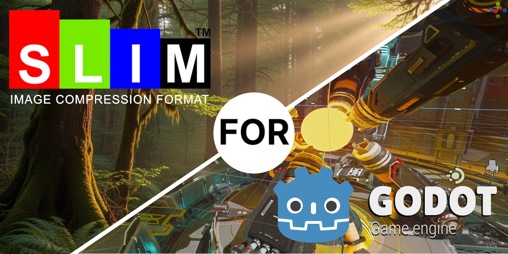
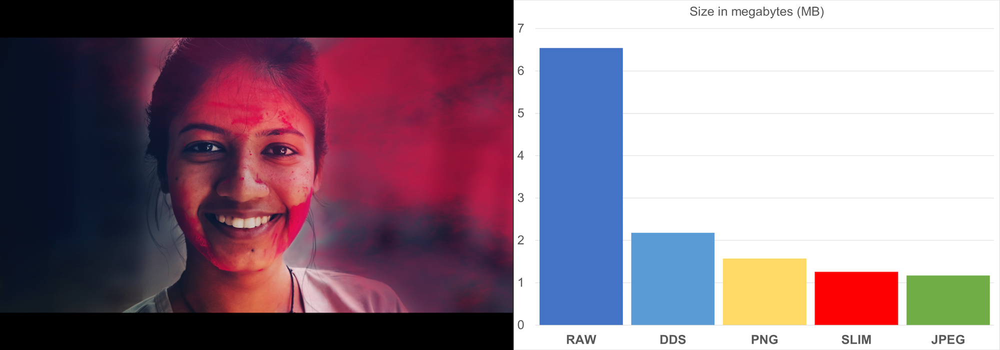

# GODOT SLIM Textures
**GODOT SLIM Textures** – This is a module for loading textures in **SLIM** format.

# SLIM
**SLIM (SLeptsov IMage)** – This is an image encoding and compression format developed as a replacement for the DDS format. This format is designed for storing raster graphics and supports resolutions up to 65535x65535 pixels. It uses lossless compression algorithms (**RLE**, **RICE**, **SLDD**, **MASKARED**) and also employs a smart quantization algorithm.

## License

This project is licensed under the [MIT License](LICENSE).

Copyright (c) 2026 Sleptsov Vladimir
